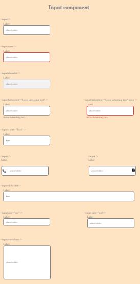

<!-- Please update value in the {}  -->

<h1 align="center">Input component</h1>

<div align="center">
  <h3>
    <a href="{https://github.com/ravinalamada/input-component}">
      Demo
    </a>
    <span> | </span>
    <a href="{https://eloquent-hopper-5d2872.netlify.app/}">
      Solution
    </a>
  </h3>
</div>

<!-- TABLE OF CONTENTS -->

## Table of Contents

-   [Overview](#overview)
    -[Built With](#built-with)
-   [Features](#features)
-   [How to use](#how-to-use)
-   [Contact](#contact)
-   [Acknowledgements](#acknowledgements)

<!-- OVERVIEW -->

## Overview



-   Where can I see your demo?
You can see my demo in by following the demo link which I wrote above.

-   What was your experience?
My experience is that we need to think further to make the designer's work better because there are many important things that are not included  in the design.

-   What have you learned/improved?
I learned that you

-   Your wisdom? :)

### Built With

<!-- This section should list any major frameworks that you built your project using. Here are a few examples.-->

-   [React](https://reactjs.org/)

## Features

<!-- List the features of your application or follow the template. Don't share the figma file here :) -->

## How To Use

<!-- Example:  -->

To clone and run this application, you'll need [Git](https://git-scm.com) and [Node.js](https://nodejs.org/en/download/) (which comes with [npm](http://npmjs.com)) installed on your computer. From your command line:

```bash
# Clone this repository
$ git clone https://github.com/your-user-name/your-project-name

# Install dependencies
$ npm install

# Run the app
$ npm start
```

## Acknowledgements

<!-- This section should list any articles or add-ons/plugins that helps you to complete the project. This is optional but it will help you in the future. For exmpale -->

-   [Node.js](https://nodejs.org/)
-   [Marked - a markdown parser](https://github.com/chjj/marked)

## Contact

-   Website [your-website.com](https://{your-web-site-link})
-   GitHub [@your-username](https://{github.com/your-usermame})
-   Twitter [@your-twitter](https://{twitter.com/your-username})
